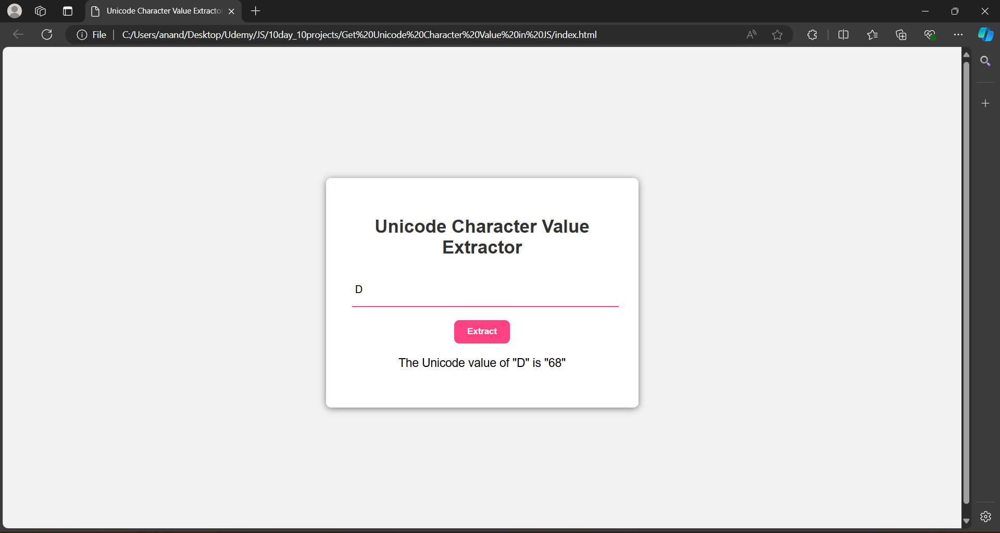

# Day 10: Get Unicode Character Value in JS

The "Get Unicode Character Value in JS" project is a web application developed using HTML, CSS, and JavaScript. This project allows users to input a character and retrieve its Unicode value. It demonstrates how to use JavaScript to work with character encoding and Unicode representation, providing a practical tool for understanding and manipulating text data at the character level. This project is an excellent exercise for learning about Unicode, character encoding, and JavaScript's string methods.

## Screenshots

