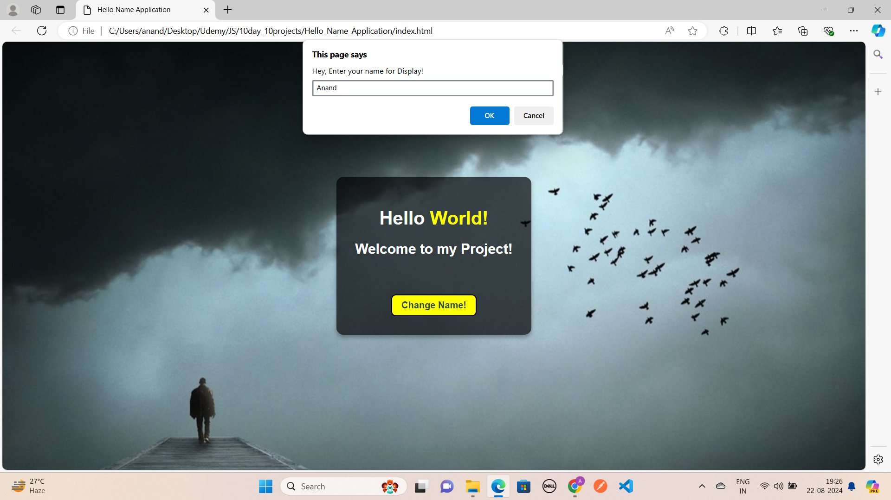

# Day 1: Hello Name Application

The "Hello Name Application" is a web app built with HTML, CSS, and JavaScript. It allows users to enter their name, and upon submission, displays a personalized greeting with "Hello [entered name]". The project showcases how to handle user input and dynamically update the DOM, making it a great learning tool for beginners in front-end web development.

## Screenshots

