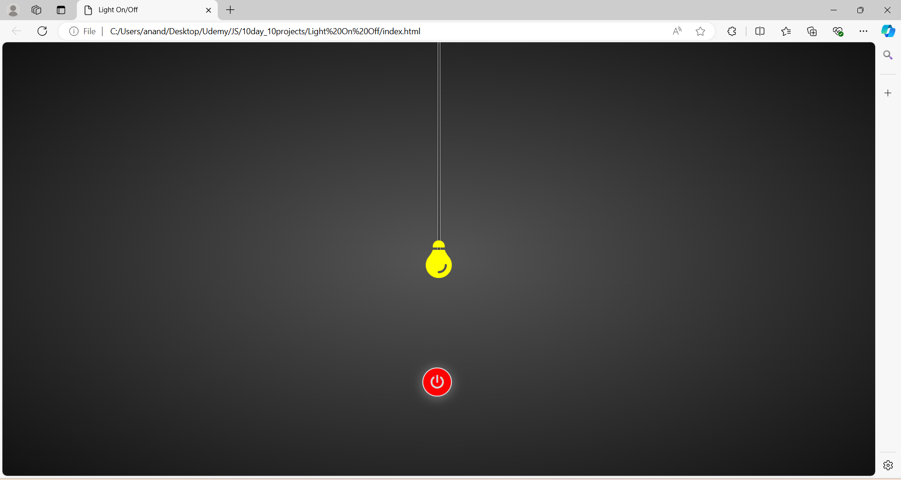

# Day 2: Light Bulb On Off Project

The "Light Bulb On Off Project" is a simple yet interactive web application developed using HTML, CSS, and JavaScript. The app visually represents a light bulb that users can toggle on and off by clicking on it. This project focuses on the fundamentals of DOM manipulation and event handling in JavaScript, providing a hands-on experience in creating dynamic web pages. It's a perfect exercise for beginners who want to understand how user interactions can be captured and processed to alter the appearance and behavior of a web element.

## Screenshots

