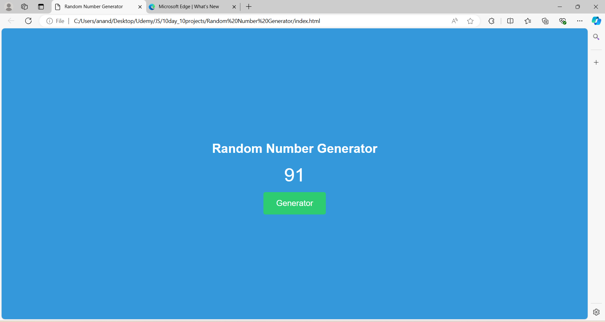

# Day 3: Random Number Generator Project

The "Random Number Generator Project" is a web application built with HTML, CSS, and JavaScript. This project generates a random number within a specified range each time the user clicks a button. It serves as a practical example of working with JavaScript's built-in randomization functions and how to create interactive user interfaces. This project is an excellent way to learn about random number generation, input handling, and DOM manipulation in web development.

## Screenshots

