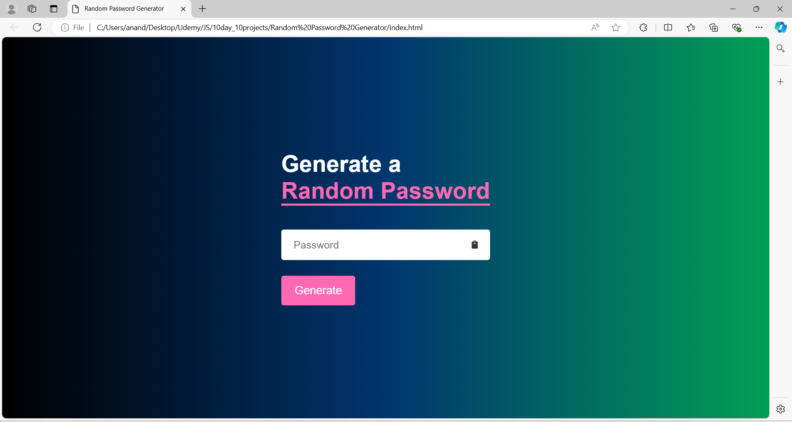

# Day 4: Generate Random Password Project

The "Generate Random Password Project" is a web application built using HTML, CSS, and JavaScript. This project allows users to generate a secure, random password based on customizable criteria such as length, and the inclusion of uppercase letters, lowercase letters, numbers, and special characters. It demonstrates how to work with JavaScript's string manipulation and randomization techniques, providing a practical exercise in creating functional and user-friendly web applications.

## Screenshots

