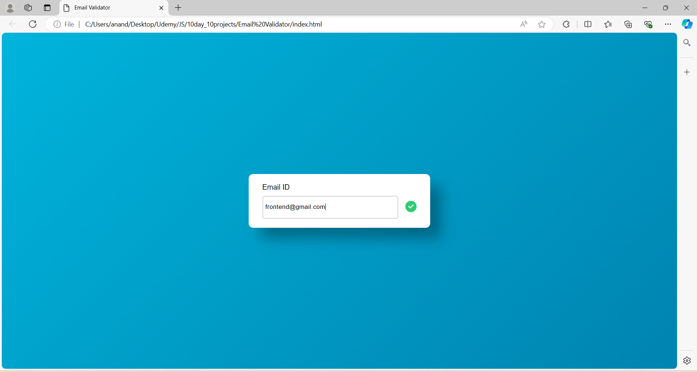

# Day 5: Email Validation Project

The "Email Validation Project" is a web application developed using HTML, CSS, and JavaScript. This project validates user input by checking if the entered email address meets common formatting rules, such as the presence of "@" and a valid domain. It showcases how to use regular expressions in JavaScript to perform input validation, ensuring that users provide correctly formatted email addresses before submission. This project is an excellent way to learn about form validation, regular expressions, and user input handling in web development.

## Screenshots

