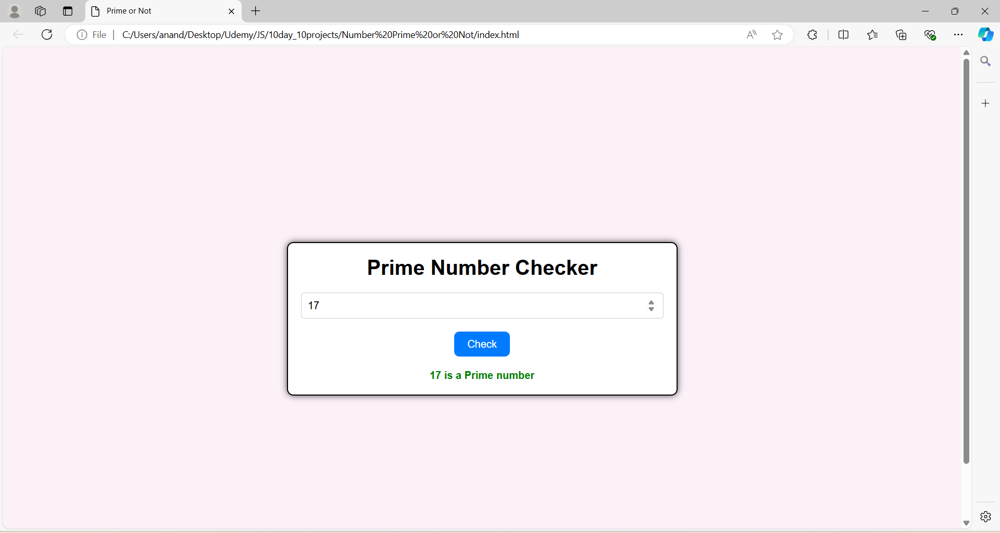

# Day 6: Prime and Non-Prime Number Project

The "Prime and Non-Prime Number Project" is a web application built using HTML, CSS, and JavaScript. This project allows users to input a number and check whether it is a prime or non-prime number. It demonstrates the implementation of mathematical logic in JavaScript to determine the primality of a number, providing an educational tool for understanding basic algorithms and number theory. This project is ideal for beginners who want to explore algorithmic problem-solving and DOM manipulation in web development.

## Screenshots

