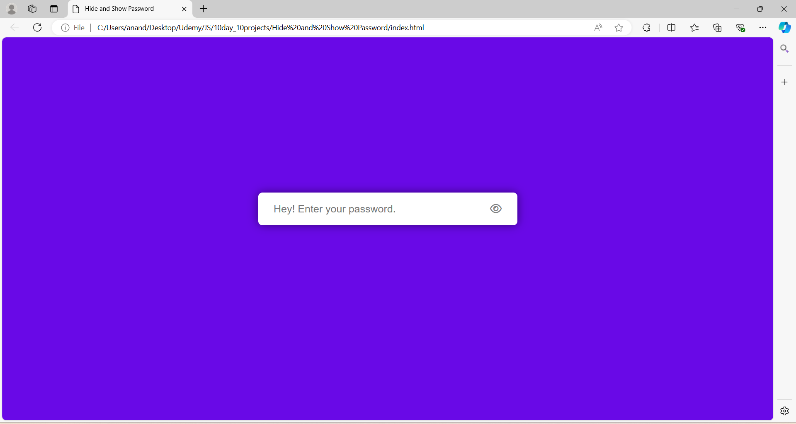

# Day 7: Hide and Show Password Project

The "Hide and Show Password Project" is a web application developed using HTML, CSS, and JavaScript. This project allows users to toggle the visibility of their password input by clicking a button, switching between masked and visible text. It demonstrates how to enhance user experience by providing control over password visibility, an essential feature in modern web forms. This project is a practical example of working with input fields, event handling, and DOM manipulation in JavaScript.

## Screenshots

