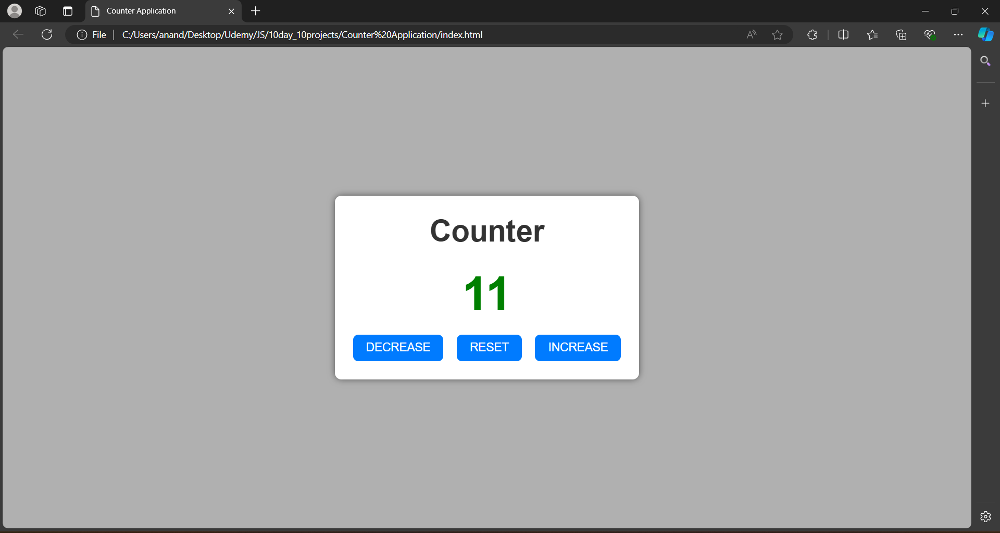

# Day 8: Counter Application

The "Counter Application" is a web app built using HTML, CSS, and JavaScript. This project allows users to increment, decrement, or reset a displayed count value with the click of a button. It provides a simple yet effective example of state management and event handling in JavaScript. This project is perfect for beginners looking to understand how to update the user interface dynamically based on user interactions, making it a great introduction to more complex interactive web applications.

## Screenshots

