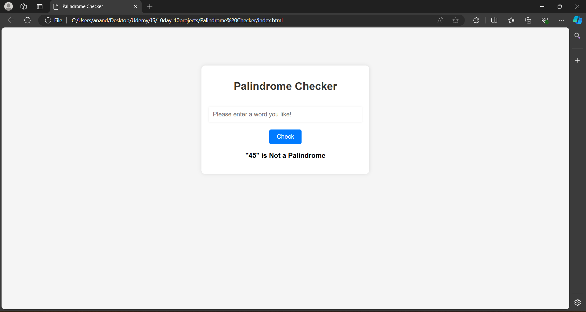

# Day 9: Palindrome Checker Application

The "Palindrome Checker Application" is a web app built using HTML, CSS, and JavaScript. This project allows users to input a word or phrase and checks whether it is a palindrome (a sequence that reads the same forward and backward). The app ignores spaces, punctuation, and case sensitivity while performing the check. This project is a great way to explore string manipulation techniques in JavaScript and apply logical operations to validate user input.

## Screenshots

